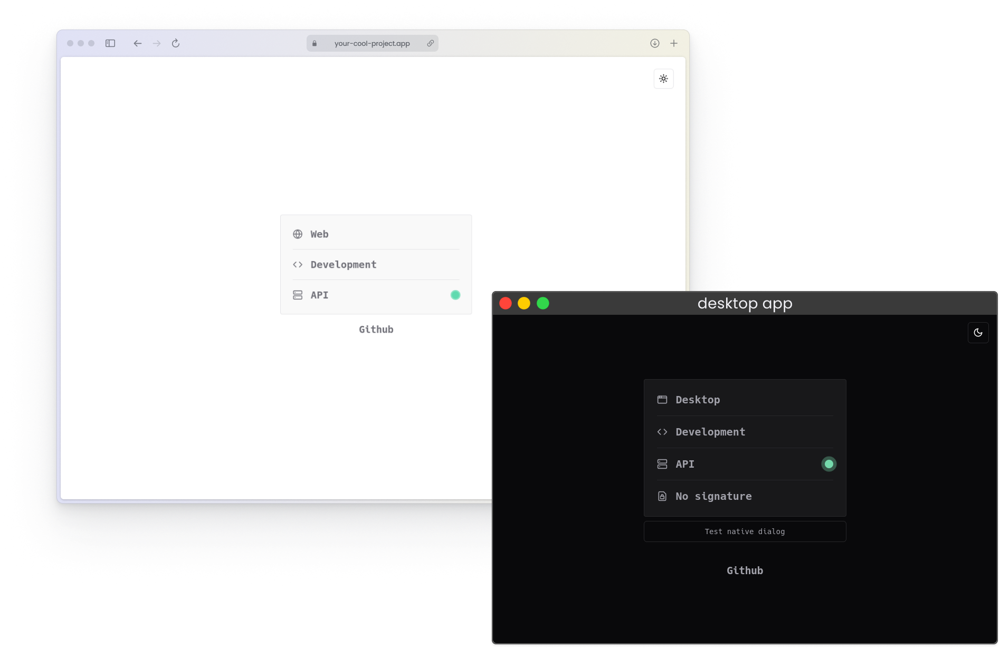

# Unified Web and Desktop Application Monorepo


This monorepo contains a shared React package (`@repo/app`) that adapts to different environments, powering both a Vite-based web app and an Electron-Vite desktop app. It uses Turborepo for efficient management and development across packages, with UI components powered by shadcn/ui and code formatting handled by Prettier.

## Preview



## Features

- ✅ **Shared Codebase**: `@repo/app` adapts to web or desktop environments
- ✅ **TypeScript**: Ensures type safety across the entire project
- ✅ **Vite & Electron-Vite**: Fast development for both web and desktop
- ✅ **Bun Backend**: High-performance API with Hono and tRPC
- ✅ **Turborepo**: Efficient monorepo management and task running
- ✅ **shadcn/ui**: Beautifully designed components that you can copy and paste into your apps
- ✅ **Prettier**: Consistent code formatting across the entire project
- ✅ **S3 Storage**: Utilizes Amazon S3 buckets for efficient file storage and retrieval
- ✅ **Electron-builder**: Automated build and distribution process for the desktop app
- ❌ **Electron Updates**: Implementing auto-update functionality for the desktop app

## Project Structure

```
/apps
  /web
  /desktop
  /backend
/packages
  /app
  /ui (shadcn/ui components)
  /shared
  /typescript-config
```

## What's Inside?

### Apps

- `web`: Vite-powered React web application
- `desktop`: Electron-Vite desktop application
- `backend`: Bun-based backend service with Hono and tRPC

### Packages

- `@repo/app`: Shared React `<App />` component
- `@repo/ui`: Shared UI components (powered by shadcn/ui)
- `@repo/shared`: Reusable components, hooks, and API integrations
- `@repo/typescript-config`: Base TypeScript configuration

## Getting Started

### Prerequisites

- [Node.js](https://nodejs.org/) (v20.17.0 or later)
- [pnpm](https://pnpm.io/) (v9.12.0 or later)
- [Bun](https://bun.sh/) (latest version)

### Installation

1. Clone the repository:
   ```sh
   git clone https://github.com/JakubGluszek/web-desktop-app.git
   cd web-desktop-app
   ```
2. Install dependencies:
   ```sh
   pnpm install
   ```
3. Set up environment variables:
   ```sh
   chmod +x ./scripts/generate-env.sh
   pnpm generate-env
   ```

### Development

Run all apps:

```sh
pnpm dev
```

Run specific apps:

```sh
pnpm dev --filter web
pnpm --filter desktop desktop:dev
pnpm dev --filter backend
```

### Building

Build all apps:

```sh
pnpm build
```

Build desktop app:

```sh
pnpm --filter desktop build:linux
pnpm --filter desktop build:win
pnpm --filter desktop build:mac
```

## Electron-builder Workflow

This project uses Electron-builder to package and distribute the desktop application. The configuration for Electron-builder can be found in the `electron-builder.yml` file. Here's what you need to know:

1. **Build Configuration**: The `electron-builder.yml` file defines build settings for Windows, macOS, and Linux platforms.
2. **Automated Builds**: GitHub Actions are used to automate the build process for different platforms.
3. **Auto-updates**: The project is set up to support auto-updates, but this feature is not yet implemented. The update server URL in the `electron-builder.yml` file will need to be configured once the Astro site and proxy server are set up.

## Repository Secrets

To ensure secure builds and deployments, you need to set up the following secrets in your GitHub repository:

1. `VITE_API_BASE_URL`: The URL of your deployed API server 
2. `AWS_ACCESS_KEY_ID`: Your AWS access key for S3 bucket access
3. `AWS_SECRET_ACCESS_KEY`: Your AWS secret key for S3 bucket access
4. `S3_BUCKET_NAME`: The name of your S3 bucket for storing builds
5. `AWS_REGION`: The region of your S3 bucket, e.g `eu-north-1`

To add these secrets:

1. Go to your GitHub repository
2. Navigate to Settings > Secrets and variables > Actions
3. Click on "New repository secret" and add each secret

## S3 Bucket Usage

This project uses Amazon S3 buckets for storing application builds. Here's how it's currently utilized:

1. **Build Storage**: Compiled application builds are uploaded to the specified S3 bucket.
2. **Future Update Distribution**: Once implemented, the auto-update feature will fetch updates via the proxy server, which will retrieve files from the S3 bucket.

Ensure that your S3 bucket is properly configured with the correct permissions and public access settings for seamless distribution.

## Adding UI Components

To add new shadcn/ui components to your project, use the following command:

```sh
pnpm ui add <component-name>
```

This command works similarly to the shadcn/ui CLI, allowing you to easily integrate new components into your project.

## Code Formatting

This project uses Prettier to ensure consistent code formatting. To format your code, run:

```sh
pnpm format
```

To check if your code is properly formatted without making changes, use:

```sh
pnpm format:check
```

## TODO

- [ ] **Create Astro "site" App**: 
   - [ ] Set up the `apps/site` directory for the Astro-based website.
   - [ ] Develop the landing page with `/register` and `/login` routes.

- [ ] **Develop API for Authentication**: 
   - [ ] Implement secure user authentication for the API application.
   - [ ] Ensure integration with the Astro site, web app, and desktop app for login and registration.

- [ ] **Enhance API App for Download Management**:
   - [ ] Update `apps/api` to handle download request proxying:
     - [ ] Implement rate limiting.
     - [ ] Secure proxying of downloads from S3.
   - [ ] Create endpoints for version info and update checks.

- [ ] **Modify S3 setup to work with the new API proxy**

- [ ] **Implement Auto-Update Functionality**: 
   - [ ] Set up auto-update functionality for the desktop application.
   - [ ] Configure Electron-builder for the new update mechanism.

## Contributing

1. Fork the repository
2. Create your feature branch: `git checkout -b feature/AmazingFeature`
3. Commit your changes: `git commit -m 'Add some AmazingFeature'`
4. Push to the branch: `git push origin feature/AmazingFeature`
5. Open a pull request

## License

This project is licensed under the MIT License. See the [LICENSE](LICENSE) file for details.
